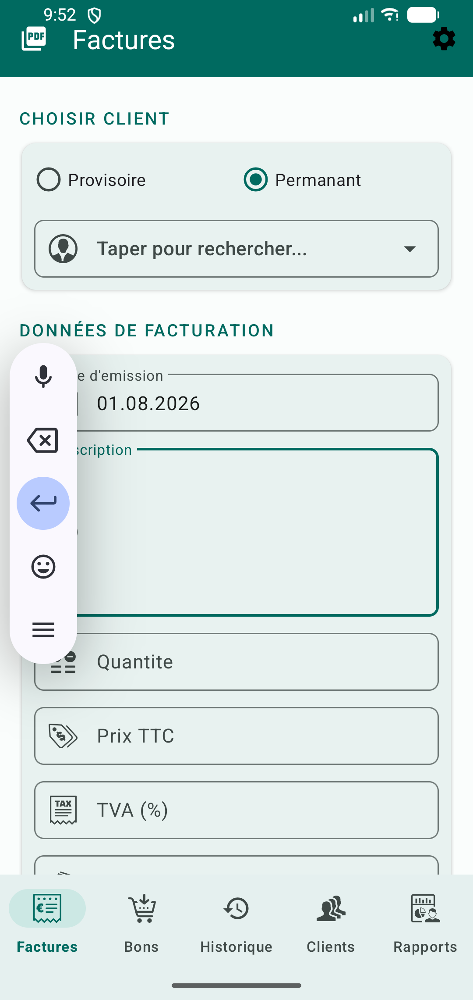
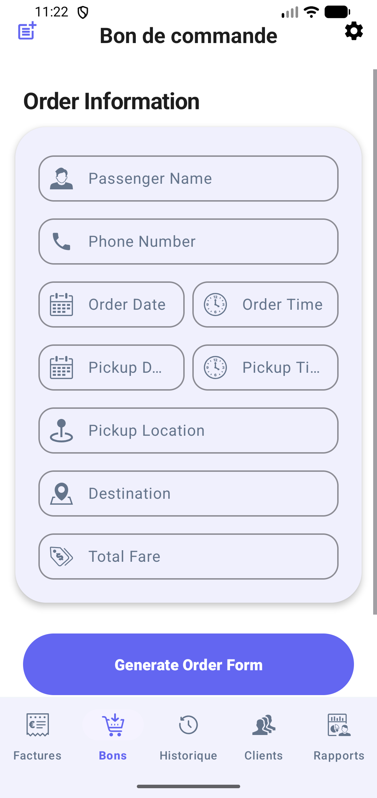
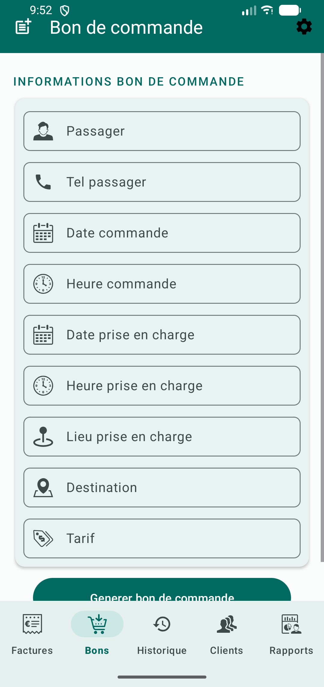
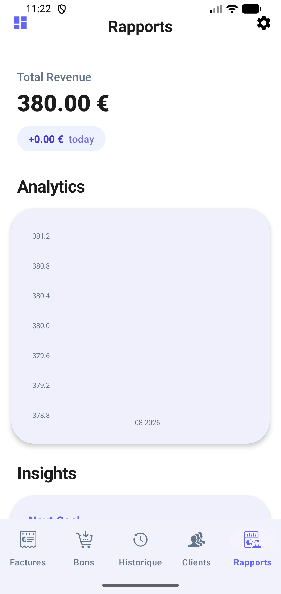
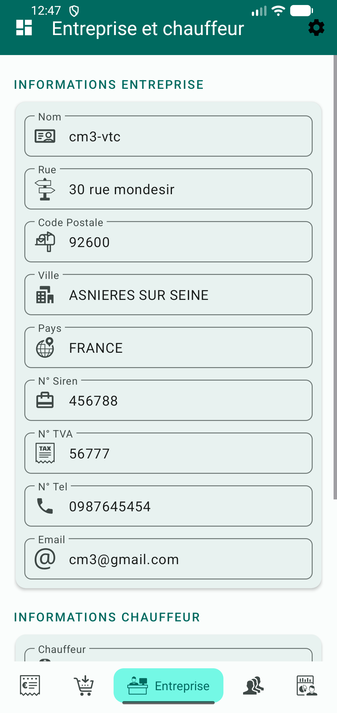
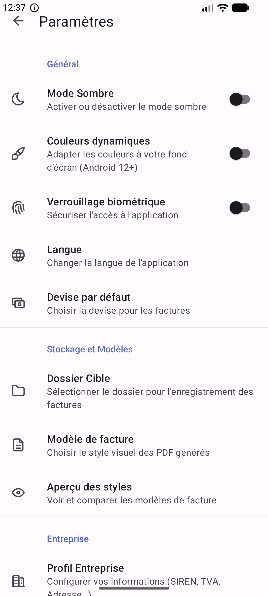

# Facture & Bon de Commande Generator

A professional Android application designed for small businesses and freelancers to easily generate, manage, and share professional PDF invoices and order forms (Bon de commande) directly from their mobile devices.

## 🚀 Features

- **Professional PDF Generation**: Create high-quality Invoices and "Bon de commande" based on optimized templates.
- **Client Management**: Save and manage a database of regular clients for quick selection during generation.
- **Business Profile**: Configure your own company details (Name, Address, SIREN, TVA, EVTC) to be automatically included in documents.
- **Dynamic Data Entry**:
    - Automatic city and country fetching based on postal code (integrated with La Poste API).
    - Material 3 Date and Time pickers for accurate document dating.
- **Smart document Management**:
    - Automatic invoice numbering.
    - Custom storage directory selection.
- **Modern UI/UX**:
    - Fully compliant with **Material 3** design guidelines.
    - **Global Dark Mode** support for a comfortable user experience in any lighting.
- **Advanced Compatibility**: Optimized for **16 KB memory page sizes**, ensuring future-proof performance on Android 15+ devices.

## 📸 Screenshots

  
  
  

  
  
  

## 🛠 Technologies Used

- **Language**: Java / Kotlin (DSL)
- **Database**: [Room Persistence Library](https://developer.android.com/training/data-storage/room) for client and history management.
- **PDF Engine**: [PDFBox-Android](https://github.com/TomRoush/PdfBox-Android) and [Android-PDF-Viewer](https://github.com/oothp/AndroidPdfViewer) for 16KB-ready rendering.
- **Networking**: [Retrofit](https://square.github.io/retrofit/) for postal code address lookup.
- **UI Components**: Material Components for Android (M3).

## 📥 Installation

1. **Prerequisites**:
    - Android Studio Ladybug (or newer).
    - Android SDK 36 (Android 16 preview) for compilation.
    - A device or emulator running Android 8.0 (API 26) or higher.

2. **Setup**:
    - Clone the repository: `git clone https://github.com/yourusername/androidInvoicePdf.git`
    - Open the project in Android Studio.
    - Sync Gradle and run the app.

## 📖 Usage

1. **Set Up Your Profile**: Navigate to the "Entreprise" section (building icon) to enter your business details. This information will appear as the "Issuer" on all generated documents.
2. **Manage Clients**: Use the "Clients" tab to add your regular customers.
3. **Generate Documents**:
    - **Invoices**: Select the "Facture" tab, choose a client (or enter a temporary one), fill in the description/price, and click **Générer Facture**.
    - **Order Forms**: Select the "Bon de commande" tab, fill in the passenger and trip details, then click **Generer bon de commande**.
4. **Share/Print**: Once the PDF is generated, you can view it directly in the app and use the Share/Email/Print buttons to send it to your customer.

## 🌓 Dark Mode
The app supports a full-system Dark Mode. You can toggle it in the **Paramètres** screen to switch between a clean Light theme and a professional Dark theme that respects Material 3 tonal palettes.

## 📄 License
This project is licensed under the MIT License - see the LICENSE file for details.
