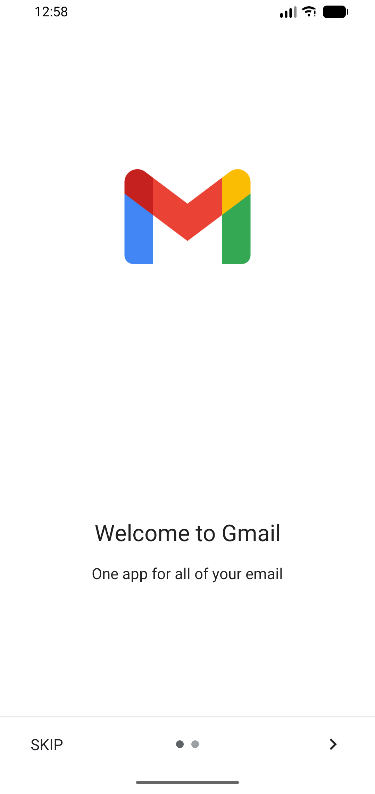
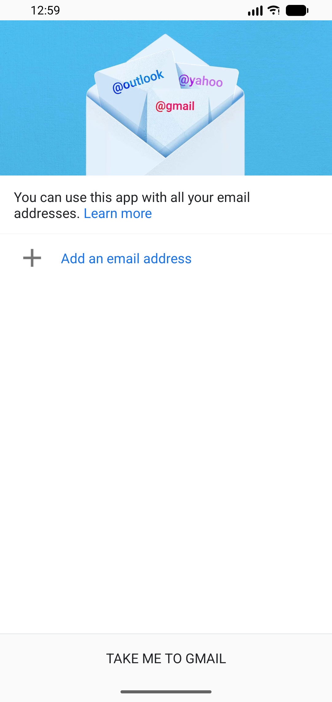
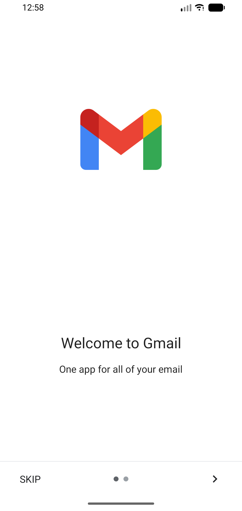
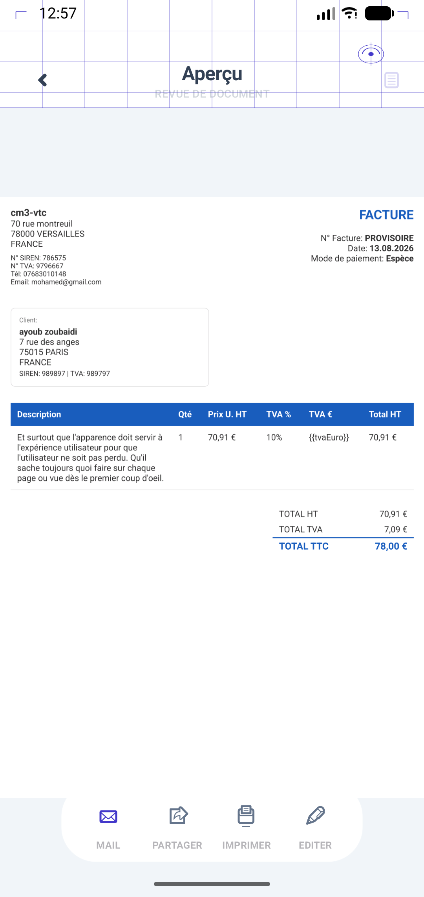
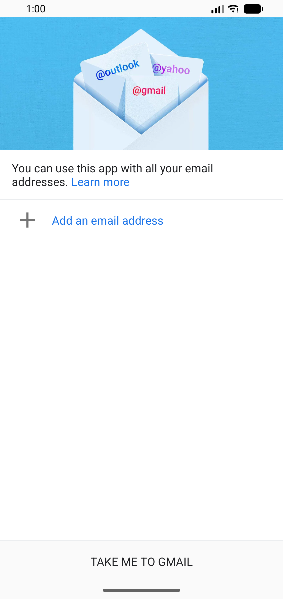

# Mes Factures - Architectural Driver Studio

A professional, high-end Material 3 Android application designed for private drivers and small businesses. Featuring a unique **"Architectural Studio"** design language, it offers precision tools to manage clients, track finances, schedule trips, and generate premium PDF documents.

## 📸 Screenshots

| Dashboard (Home) | Activity History | Clients Hub |
| :---: | :---: | :---: |
|  |  |  |

| Analytics (Stats) | Settings | Agenda |
| :---: | :---: | :---: |
|  |  |  |

| Documents Hub | Creation Studio |
| :---: | :---: |
|  |  |

## 🎨 Design Language: "Architectural Studio"
The app features a custom-engineered UI/UX based on structural precision:
- **Blueprint Headers**: Every section is anchored by a technical blueprint-style header with "Aurora" prism glows and ghost technical grids.
- **Terminal Flow**: Status indicators and steppers use a "Technical Node" aesthetic with precision dots and fading connection rails.
- **Minimalist Hierarchy**: Separation is achieved through typography (`sans-serif-black`) and structural lines rather than heavy cards, providing a light, premium feel.

## 🚀 Key Features

### 📄 Premium Document Generation
- **Creation Studio**: A "Drafting Table" interface for generating PDF Invoices & Order Forms with live blueprint preview.
- **Instant Sharing**: Share documents instantly via WhatsApp, Email, or Print.
- **Precision Templates**: Professional layouts with high-quality typography.

### 📊 Business Intelligence & Analytics
- **Financial Pulse**: Real-time overview of monthly/daily profit with dynamic "Wave" background charts.
- **Interactive Analytics**: Deep-dive into your revenue trends with technical bar charts.
- **Expense Tracking**: Deduct business costs to view your actual net margin.
- **Activity Stream**: A unified technical log of all documents, trips, and edits.

### 📅 Agenda & Client Management
- **Smart Scheduler**: Integrated calendar with "Underglow Aura" design for managing future courses.
- **Client Vault**: Manage customer SIREN/TVA details and view the lifetime value of each client.
- **Contact Sync**: Seamlessly import customers from your phone contacts.

### 🛡️ Security & Performance
- **Biometric Security**: Lock your financial data with Fingerprint or Face ID.
- **Technical Backup**: Full database and document export into a secure ZIP file.
- **Offline First**: Optimized for field work with zero internet reliance.

## 🛠 Tech Stack

- **Architecture**: Clean MVVM with Jetpack Components.
- **Database**: Room Persistence Library.
- **UI Components**: Material 3, Lottie, custom Vector-based "Architectural" drawables.
- **Visualization**: MPAndroidChart.
- **PDF Engine**: PDFBox-Android.
- **Celebrations**: Konfetti for rewarding success.

## 📥 Installation

1. **Prerequisites**: Android SDK 36, Android 8.0+.
2. **Setup**: Clone the repo and run the `:app` module in Android Studio.

## 📄 License
MIT License.
